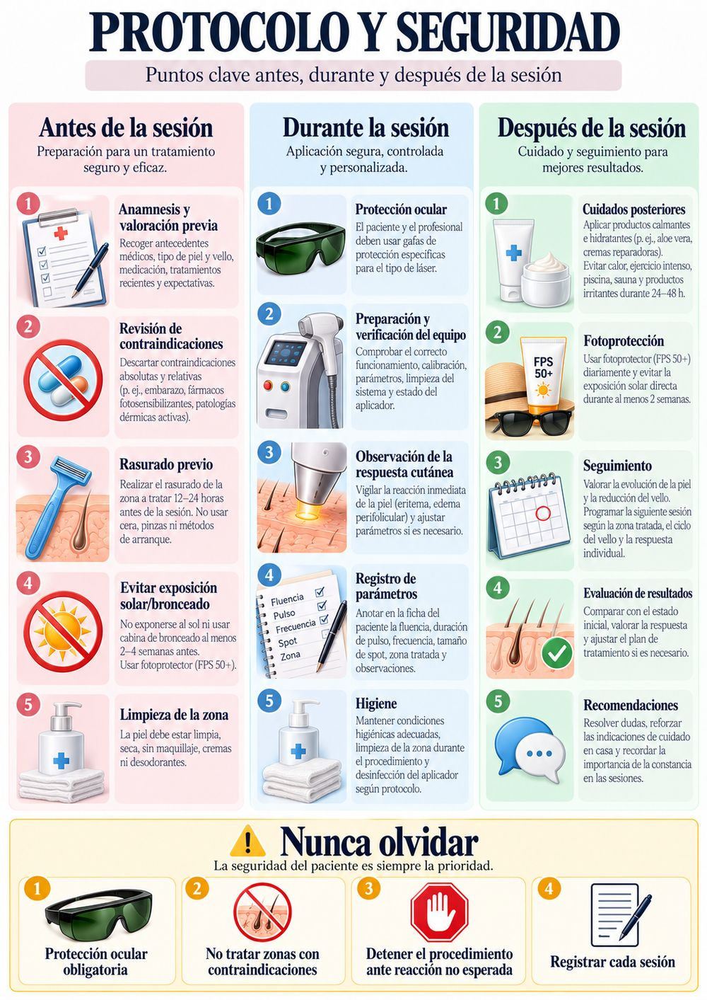
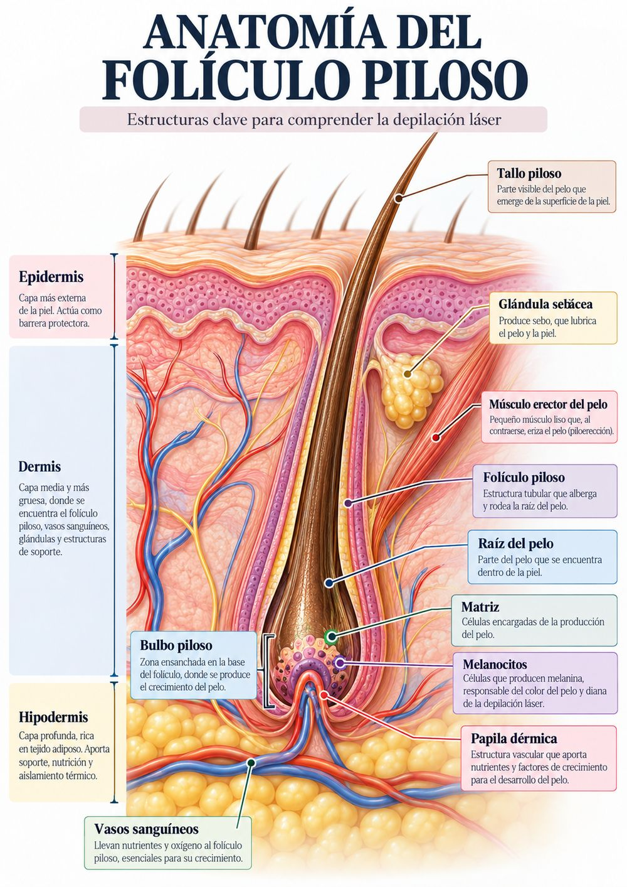
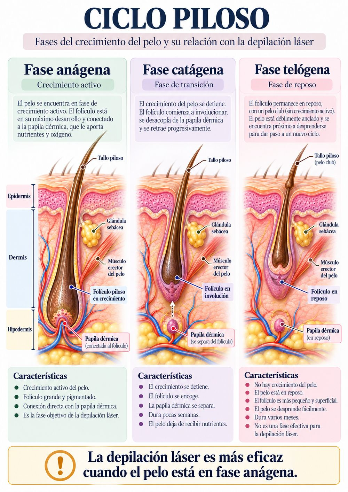
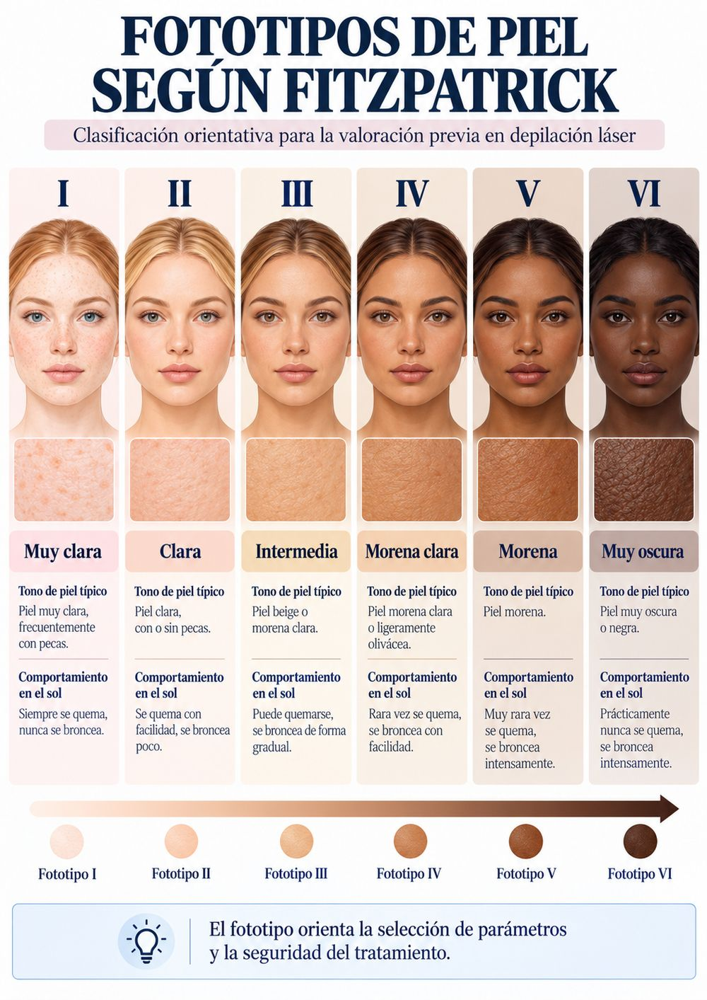
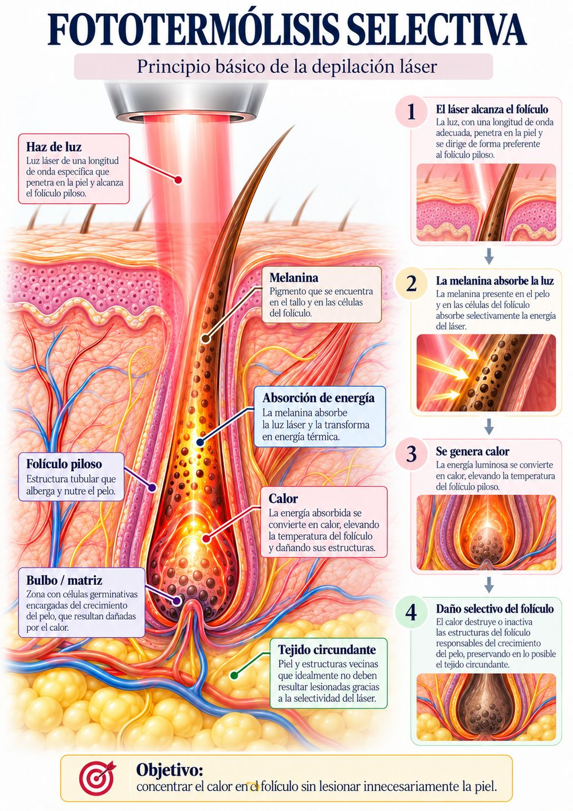
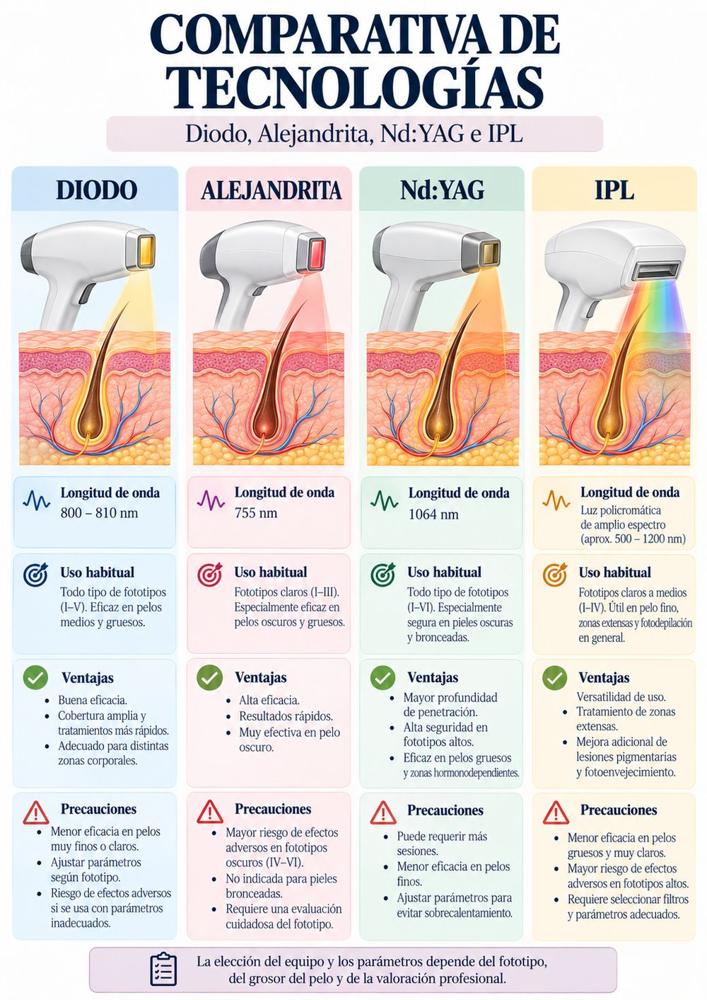

<!-- Depilación láser · manual profesional 60 h. Fuente versionada de la
     materia del aula (la copia real, con las imágenes embebidas, vive en el
     bucket privado course-private y se sube desde el panel de administración). -->

Manual profesional<h1>Depilación láser</h1>
Fundamentos, valoración, seguridad y práctica supervisada

<b>60</b>horas

<b>28 h</b>teoría online

<b>32 h</b>práctica presencial

<b>7</b>módulos teóricos

<b>8</b>jornadas prácticas

<figure class="ac-fig"><figcaption>Secuencia didáctica de referencia para cada sesión.</figcaption></figure>

Material formativo en español con ilustraciones originales, ejercicios, pruebas de aprendizaje, casos y rúbricas.

<b>Aviso de alcance</b>
Este manual es material de formación general y no sustituye la capacitación específica del equipo, sus instrucciones de uso, la valoración sanitaria cuando proceda ni la normativa estatal y autonómica aplicable. La autorización para operar, el ámbito profesional y los requisitos del centro deben verificarse localmente. No se prescriben parámetros universales: se aplican únicamente los indicados por el fabricante para el dispositivo, la zona y la persona, dentro de la competencia profesional y con supervisión adecuada.

<nav class="ac-indice">Índice<ol><li><a href="#" data-ir="sec-como-usar-este-manual">Cómo usar este manual</a></li><li><a href="#" data-ir="sec-modulo-1-piel-pelo-y-foliculo">Módulo 1. Piel, pelo y folículo</a></li><li><a href="#" data-ir="sec-modulo-2-ciclo-piloso-y-fototipos">Módulo 2. Ciclo piloso y fototipos</a></li><li><a href="#" data-ir="sec-modulo-3-fisica-de-la-luz-y-fototermolisis-selectiva">Módulo 3. Física de la luz y fototermólisis selectiva</a></li><li><a href="#" data-ir="sec-modulo-4-tecnologias-y-equipos">Módulo 4. Tecnologías y equipos</a></li><li><a href="#" data-ir="sec-modulo-5-valoracion-anamnesis-y-criterios-de-aplazamiento">Módulo 5. Valoración, anamnesis y criterios de aplazamiento</a></li><li><a href="#" data-ir="sec-modulo-6-seguridad-protocolo-y-efectos-adversos">Módulo 6. Seguridad, protocolo y efectos adversos</a></li><li><a href="#" data-ir="sec-modulo-7-cuidados-documentacion-casos-y-repaso">Módulo 7. Cuidados, documentación, casos y repaso</a></li><li><a href="#" data-ir="sec-practicas-presenciales">Prácticas presenciales</a></li><li><a href="#" data-ir="sec-cinco-casos-practicos">Cinco casos prácticos</a></li><li><a href="#" data-ir="sec-examen-practico-integrado">Examen práctico integrado</a></li><li><a href="#" data-ir="sec-fuentes-y-lecturas-de-referencia">Fuentes y lecturas de referencia</a></li></ol></nav>

Introducción<h2>Cómo usar este manual</h2>

El curso suma 60 horas exactas: siete módulos de cuatro horas (28 h de estudio online) y ocho jornadas presenciales de cuatro horas (32 h). Cada módulo combina explicación, tablas de síntesis y actividades. Las jornadas organizan demostración, práctica entre compañeras o modelos debidamente informados y supervisión docente. La práctica directa sobre personas solo se realiza si el centro está autorizado, con consentimiento, evaluación previa y supervisión competente.

| Componente | Horas | Evidencia de aprendizaje |
|---|---|---|
| Teoría online: módulos 1–7 | 28 | Ejercicios y seis tests de cinco preguntas |
| Prácticas presenciales: jornadas 1–8 | 32 | Listas de cotejo y registro individual |
| Evaluación final | Integrada | Examen teórico de 30 preguntas y prueba práctica |

### Mapa curricular

| Módulo teórico (4 h cada uno) | Jornada práctica (4 h cada una) |
|---|---|
| 1. Piel, pelo y folículo | 1. Cabina, equipo y seguridad |
| 2. Ciclo piloso y fototipos | 2. Consulta y valoración |
| 3. Física de la luz y fototermólisis | 3. Preparación y simulación del protocolo |
| 4. Tecnologías y equipos | 4. Pruebas de parche y decisión clínica simulada |
| 5. Valoración, anamnesis y criterios de aplazamiento | 5. Práctica supervisada en zonas no faciales |
| 6. Seguridad, protocolo y efectos adversos | 6. Práctica supervisada y cambio de zonas/equipo |
| 7. Cuidados, documentación, casos y repaso | 7. Incidencias, mantenimiento y documentación |
|  | 8. Evaluación práctica integrada |

Módulo 1 de 7<h2>Piel, pelo y folículo</h2>Duración: 4 horas de estudio online.

Resultados de aprendizaje<ol><li>Distinguir las capas cutáneas y sus funciones generales.</li><li>Reconocer las partes del pelo y del folículo relevantes para la fotodepilación.</li><li>Explicar por qué la melanina del tallo y la unidad pilosebácea es un cromóforo principal.</li></ol>

<figure class="ac-fig"><figcaption>Esquema 1. Anatomía simplificada del folículo.</figcaption></figure>

### Piel y barrera cutánea

La epidermis es un epitelio estratificado sin vasos propios; su estrato córneo reduce la pérdida de agua y constituye una barrera. La dermis aporta matriz, vasos, nervios y soporte mecánico. La hipodermis contiene tejido adiposo y conectivo y varía por región.

La superficie visible no informa por sí sola del estado de la barrera. Irritación, inflamación, lesión, infección, pigmentación reciente y bronceado alteran la evaluación y pueden exigir aplazar o derivar.

### Unidad pilosebácea

El folículo es una invaginación de la epidermis hacia la dermis. El tallo visible está formado por células queratinizadas. En la base, el bulbo rodea la papila dérmica vascularizada; la matriz produce el pelo. La glándula sebácea desemboca en el folículo y el músculo erector se inserta en la unidad.

El pigmento (melanina) está en el tallo y estructuras foliculares en crecimiento. La energía óptica absorbida por melanina se transforma en calor. El objetivo y la respuesta dependen de profundidad, calibre, pigmentación, fase y parámetros; la estructura anatómica no puede observarse por completo desde fuera.

### Aplicación a la práctica

El pelo terminal suele ser más grueso y pigmentado que el vello fino; pelo blanco, gris, rubio muy claro o rojo puede responder poco porque tiene menos melanina absorbente. No debe prometerse eliminación permanente de todo el pelo: suele hablarse de reducción duradera, con variabilidad y posibles sesiones de mantenimiento.

### Ficha de estudio

| Estructura | Función / relevancia |
|---|---|
| Tallo | Pelo visible, queratinizado; contiene melanina. |
| Folículo | Entorno epitelial que aloja y guía el pelo. |
| Bulbo y matriz | Zona de formación del pelo en fase activa. |
| Papila dérmica | Aporta soporte y señales al folículo. |
| Glándula sebácea | Secreta sebo hacia el canal folicular. |
| Músculo erector | Eleva el pelo; no es el blanco térmico. |

Módulo 2 de 7<h2>Ciclo piloso y fototipos</h2>Duración: 4 horas de estudio online.

Resultados de aprendizaje<ol><li>Describir anágena, catágena y telógena.</li><li>Relacionar el ciclo asíncrono con la necesidad de sesiones espaciadas.</li><li>Utilizar Fitzpatrick como referencia complementaria y no como ajuste automático.</li></ol>

<figure class="ac-fig"><figcaption>Esquema 2. Fases del ciclo piloso.</figcaption></figure>

### Fases del ciclo

Anágena: crecimiento activo; el tallo pigmentado está conectado con la unidad profunda. Es habitualmente la fase con mayor susceptibilidad al daño térmico dirigido a estructuras pilosas, aunque la eficacia real depende de dispositivo, pelo, zona y tratamiento.

Catágena: transición regresiva breve; cesa el crecimiento y el folículo involuciona. Telógena: reposo y desprendimiento; después puede comenzar una nueva anágena. Los pelos de una región no están todos sincronizados.

### Fototipos Fitzpatrick I–VI

Fitzpatrick clasifica la respuesta habitual a radiación ultravioleta (tendencia a quemarse/broncearse), no mide directamente la cantidad de melanina ni predice con precisión cada respuesta al láser. Registra por separado fototipo, tono observado, bronceado reciente, hiperpigmentación y antecedentes de reacción.

En pieles más pigmentadas o bronceadas, la epidermis compite más por la energía; aumenta la importancia de elegir una longitud de onda y un protocolo apropiados al dispositivo, mantener enfriamiento indicado y respetar la prueba de tolerancia. Un fototipo no habilita a tratar ni determina por sí solo la fluencia.

<figure class="ac-fig"><figcaption>Esquema 3. Representación ilustrativa de Fitzpatrick. La asignación individual requiere entrevista y observación.</figcaption></figure>

### Tabla de referencia

| Tipo | Respuesta solar típica (orientativa) | Consideración formativa |
|---|---|---|
| I | Siempre se quema; casi nunca se broncea | Alta sensibilidad solar; documentar reacción. |
| II | Suele quemarse; se broncea poco | Valorar tono actual y exposición. |
| III | A veces se quema; bronceado gradual | No inferir seguridad sin valoración. |
| IV | Se quema poco; se broncea con facilidad | Registrar bronceado reciente. |
| V | Raramente se quema; pigmentación intensa | Mayor competencia epidérmica posible. |
| VI | Muy raramente se quema; pigmentación profunda | Elección técnica y supervisión especializadas. |

Módulo 3 de 7<h2>Física de la luz y fototermólisis selectiva</h2>Duración: 4 horas de estudio online.

Resultados de aprendizaje<ol><li>Diferenciar láser de luz pulsada intensa.</li><li>Definir longitud de onda, fluencia, duración de pulso, frecuencia, spot y enfriamiento.</li><li>Explicar el principio de fototermólisis selectiva y sus límites.</li></ol>

<figure class="ac-fig"><figcaption>Esquema 4. Cadena conceptual de fototermólisis selectiva.</figcaption></figure>

### Luz y cromóforos

Un láser emite luz con propiedades espectrales y de coherencia específicas; IPL emite un espectro amplio filtrado, no es láser. En depilación interesan principalmente la melanina del pelo y, como competidores, melanina epidérmica y hemoglobina. La absorción depende de la longitud de onda y del tejido.

### Parámetros que interactúan

Longitud de onda (nm): condiciona absorción y penetración óptica. Fluencia (J/cm²): energía por superficie. Duración del pulso (ms): tiempo de entrega; debe adaptarse a las características del blanco y a las instrucciones del fabricante. Frecuencia (Hz): pulsos por segundo; en movimiento continuo determina ritmo y solapamiento. Spot: tamaño de la zona iluminada; influye en cobertura y distribución de energía. Refrigeración: protege epidermis y mejora tolerancia cuando el sistema está diseñado para ello.

No cambiar un parámetro aislado de forma intuitiva. La combinación segura depende del modelo, modo de emisión, aplicador, calibración, zona, pelo, tono de piel, enfriamiento y prueba previa. No se trasladan ajustes de un equipo a otro aunque tengan una longitud de onda similar.

### Fototermólisis selectiva

La luz se absorbe en el cromóforo, se convierte en calor y produce lesión térmica preferente si la energía y el tiempo se ajustan al objetivo sin difundir calor excesivo a tejidos vecinos. La selectividad es relativa, nunca absoluta. Pulsos demasiado agresivos, piel bronceada, solapamiento, mala refrigeración o mala técnica pueden causar quemadura o cambios pigmentarios.

Un enrojecimiento perifolicular leve y transitorio puede aparecer, pero no debe buscarse una respuesta intensa como prueba de eficacia. Dolor desproporcionado, blanqueamiento grisáceo, ampolla, carbonización o eritema confluyente: detener inmediatamente y activar el protocolo de incidencia.

Actividad de aprendizaje
Escribe una explicación de 120 palabras comparando la fluencia y la duración del pulso; añade dos motivos por los que nunca deben copiarse ajustes entre equipos.

### Ficha técnica

| Variable | Qué describe | Pregunta antes de operar |
|---|---|---|
| Longitud de onda | Espectro emitido (nm) | ¿El fabricante indica idoneidad para esta piel y pelo? |
| Fluencia | Energía por área (J/cm²) | ¿Está dentro del protocolo validado para este modelo? |
| Duración | Tiempo de cada pulso | ¿Concuerda con el modo, zona y recomendación? |
| Frecuencia | Pulsos/s (Hz) | ¿Mantengo velocidad y solapamiento indicados? |
| Spot | Área iluminada | ¿El cabezal está apoyado y perpendicular según IFU? |
| Enfriamiento | Control térmico epidérmico | ¿Está operativo y es suficiente según instrucciones? |

Módulo 4 de 7<h2>Tecnologías y equipos</h2>Duración: 4 horas de estudio online.

Resultados de aprendizaje<ol><li>Comparar Diodo, Alejandrita, Nd:YAG e IPL con lenguaje no absoluto.</li><li>Reconocer que la etiqueta comercial no garantiza seguridad o eficacia.</li><li>Leer las instrucciones de uso y el etiquetado del equipo antes de operarlo.</li></ol>

<figure class="ac-fig"><figcaption>Esquema 5. Tecnologías y rangos espectrales indicativos; no representa una prescripción.</figcaption></figure>

### Comparación orientativa

Alejandrita (~755 nm), diodo (habitualmente en torno a 800–810 nm, con variantes), Nd:YAG (1064 nm) e IPL (espectro amplio con filtros) presentan perfiles de absorción y penetración diferentes. En general, la melanina absorbe más las longitudes de onda más cortas que 1064 nm; Nd:YAG suele reducir absorción epidérmica relativa, lo cual puede ser útil en algunos fototipos oscuros, pero no elimina el riesgo.

La elección depende del equipo concreto, tono actual, pelo, zona, historial y formación. “Diodo”, “SHR” o “triple onda” no son garantías. SHR se usa comercialmente para modos de baja fluencia/alta repetición o barrido en determinados equipos; describe un modo de entrega, no una longitud de onda independiente.

### Equipo y control

Antes del uso, verificar identificación, documentación, accesorios, estado de cables/manípulo, cristal, refrigeración, alarmas, mantenimiento y calibración según fabricante. Confirmar que el aplicador corresponde al tratamiento y que gafas cliente/operador están certificadas para rango espectral y densidad óptica requeridos. Si falta una pieza, hay daño, alarma, lectura inestable o instrucción poco clara: no usar y escalar al responsable técnico.

### Límites comparativos

Las tablas de esta formación son didácticas y no clasifican un producto comercial. Consultar siempre indicación, contraindicaciones, consumibles, filtros y parámetros del manual de usuario. La tecnología más apropiada no se decide por publicidad, precio ni fototipo aislado.

### Matriz comparativa

| Sistema | Naturaleza | Observación didáctica | Límite |
|---|---|---|---|
| Alejandrita | Láser ~755 nm | Absorción de melanina relativamente alta | Cuidado con epidermis pigmentada/bronceada; equipo-specific. |
| Diodo | Láser, bandas variables | Uso extendido; distintos modos y refrigeración | No existe un ajuste universal entre modelos. |
| Nd:YAG | Láser 1064 nm | Menor absorción relativa de melanina epidérmica | No equivale a ausencia de riesgo o eficacia garantizada. |
| IPL | Luz pulsada filtrada | Espectro amplio; selección de filtro importa | No es láser; filtros y pulso dependen del equipo. |
| SHR / barrido | Modo comercial de algunos sistemas | Puede implicar pases repetidos y movimiento | Definición varía; seguir IFU exacta. |

Módulo 5 de 7<h2>Valoración, anamnesis y criterios de aplazamiento</h2>Duración: 4 horas de estudio online.

Resultados de aprendizaje<ol><li>Realizar entrevista estructurada con privacidad y consentimiento.</li><li>Identificar datos que requieren aplazar, consultar o derivar.</li><li>Documentar zona, pelo, piel, exposición, medicación e historial.</li></ol>

### Anamnesis y evaluación

Explicar finalidad, límites, sensaciones, alternativas, riesgos razonables, número variable de sesiones, necesidad de mantenimiento y cuidados. Obtener consentimiento informado antes de la sesión, incluyendo autorización específica para fotografías cuando proceda. Recoger solo datos necesarios y proteger su confidencialidad.

Registrar tono/fototipo como referencia, bronceado o autobronceador reciente, exposición solar, color y calibre del pelo, métodos usados, sesiones previas y respuesta. Inspeccionar la zona con luz adecuada para detectar heridas, infección, irritación, tatuaje, lesión pigmentada o anomalía no aclarada. No diagnosticar lesiones cutáneas: aplazar y derivar si hay incertidumbre.

### Medicaciones y condiciones

Preguntar por medicación prescrita y no prescrita, productos tópicos y antecedentes de fotosensibilidad o cicatrización anómala. No suspender ni modificar medicación por cuenta propia; consultar al prescriptor o seguir la instrucción concreta del fabricante. Ante embarazo, enfermedad activa, lesión, brote, infección, herpes en zona, historia de reacción intensa o medicación potencialmente fotosensibilizante, no improvisar: aplicar el protocolo local y criterio sanitario competente.

Evitar listas simplistas de “contraindicación absoluta” universales. El alcance depende del uso previsto, IFU, normativa y juicio clínico. Cuando no pueda aclararse con seguridad, se aplaza el tratamiento.

### Decisión y prueba previa

Clasificar cada consulta: tratar solo si profesional competente confirma idoneidad y se cumplen todas las condiciones; aplazar si hay exposición/bronceado, irritación, preparación inadecuada o evaluación incompleta; derivar/consultar si hay lesión, condición médica o medicación que excede competencia. La prueba de parche/sensibilidad se realiza donde y como indique IFU y protocolo del centro; observar y documentar el intervalo indicado antes de tratar área extensa.

Actividad de aprendizaje
Completa la ficha de anamnesis de una persona ficticia y marca decisión: tratar, aplazar o derivar, justificando cada dato.

### Ficha de valoración previa

| Campo | Registro |
|---|---|
| Identificación mínima y consentimiento | Fecha / confirmación: __________________ |
| Zona y objetivo esperado | ________________________________________ |
| Piel | Fototipo orientativo ___  tono actual ___  bronceado/exposición ___ |
| Pelo | Color ___  calibre ___  densidad ___  zona ___ |
| Historial relevante | Medicaciones/productos ___  reacciones previas ___ |
| Inspección | Integridad ___  lesiones/tatuajes ___  observaciones ___ |
| Decisión | □ Tratar  □ Aplazar  □ Consultar/derivar  Motivo: ___ |
| Prueba previa | Parámetros según IFU ___  sitio ___  fecha/revisión ___ |
| Consentimiento/documentación | □ Consentimiento  □ Fotografías autorizadas (si aplica) |

Módulo 6 de 7<h2>Seguridad, protocolo y efectos adversos</h2>Duración: 4 horas de estudio online.

Resultados de aprendizaje<ol><li>Aplicar controles de ingeniería, administrativos y de protección personal.</li><li>Seguir una secuencia de sesión segura sin omitir barreras.</li><li>Reconocer y responder a incidentes dentro de la propia competencia.</li></ol>

<figure class="ac-fig"><figcaption>Esquema 6. Controles y flujo general; la instrucción de uso específica prevalece.</figcaption></figure>

### Seguridad del recinto y ocular

La radiación directa o reflejada puede lesionar ojos y piel; parte de la emisión infrarroja puede ser invisible. Delimitar acceso, señalizar la sala, controlar superficies reflectantes, proteger a todas las personas presentes y seguir la clase y medidas requeridas por fabricante y evaluación de riesgos. Las gafas deben estar identificadas y adecuadas a longitud de onda/rango y densidad óptica; gafas genéricas de sol no sirven. Mantenerlas puestas durante toda emisión.

### Secuencia de sesión

1) confirmar identidad, consentimiento, indicación y zona; 2) revisar anamnesis y cambios desde visita previa; 3) inspeccionar piel y confirmar preparación; 4) retirar productos y marcar zona de forma segura; 5) poner gafas y verificar equipo/enfriamiento/accesorios; 6) confirmar protocolo y prueba previa; 7) aplicar conforme a IFU, observando piel, dolor y contacto; 8) detener ante respuesta inesperada; 9) aplicar cuidados permitidos, dar pautas verbales/escritas y registrar parámetros y respuesta.

### Incidentes y respuesta

Ante sospecha de lesión ocular, dolor ocular o exposición inadvertida: detener emisión, no frotar el ojo y activar asistencia médica urgente según protocolo. Ante quemadura cutánea, ampolla, dolor intenso, reacción extensa o síntomas sistémicos: detener, apagar/asegurar el equipo, prestar primeros auxilios básicos dentro de formación, solicitar evaluación sanitaria urgente y documentar. No aplicar remedios caseros ni reanudar la sesión. Avisar a responsable y conservar los datos del dispositivo/evento.

### Higiene y mantenimiento

Limpiar y desinfectar superficies y aplicadores entre usuarios siguiendo materiales compatibles e IFU. No sumergir ni usar químicos no aprobados. Revisar filtros, ventana, cables, pedal y refrigeración. Mantener registros de mantenimiento, incidencias, controles y formación. No reparar ni modificar el equipo si no se está autorizado.

### Lista de comprobación

| Antes | Durante | Después |
|---|---|---|
| □ Sala señalizada y acceso controlado □ Equipo y enfriamiento verificados □ Gafas correctas e íntegras □ Consentimiento y piel revisados | □ Gafas puestas por todos □ Cabezal/contacto según IFU □ Observación continua de piel y dolor □ Detener ante señal inesperada | □ Cuidados según protocolo □ Instrucciones posteriores entregadas □ Sesión registrada □ Equipo limpio y fallo comunicado |

Módulo 7 de 7<h2>Cuidados, documentación, casos y repaso</h2>Duración: 4 horas de estudio online.

Resultados de aprendizaje<ol><li>Indicar cuidados posteriores individualizados y signos de alarma.</li><li>Registrar los datos necesarios para trazabilidad y continuidad.</li><li>Resolver casos con una decisión segura y una explicación comprensible.</li></ol>

### Cuidados posteriores

Puede presentarse eritema o edema perifolicular leve y transitorio. Seguir las recomendaciones del fabricante y del centro: enfriar suavemente si está indicado, evitar fricción/calor intenso temporalmente, proteger del sol y no manipular la zona. No usar exfoliantes u otros activos irritantes sobre piel reactiva. El calendario exacto se individualiza; no prometer intervalos fijos ni resultados garantizados.

Indicar consulta sanitaria si aparecen ampollas, dolor creciente, costras extensas, secreción, alteraciones de pigmento persistentes, síntomas oculares o cualquier reacción preocupante.

### Registro de sesión

Fecha y profesional; zona; evaluación actualizada; equipo, aplicador y versión; parámetros completos tal como muestra el dispositivo; prueba previa; método/cobertura de pases conforme IFU; enfriamiento; respuesta de piel y paciente; incidencias; cuidados entregados; próxima revisión. Aplicar normativa de protección de datos, acceso limitado y plazos de conservación vigentes.

### Comunicación y ética

Hablar de reducción del vello y respuesta variable, no de garantía de depilación permanente universal. Explicar que el pelo claro/blanco puede responder poco y que factores hormonales y ciclo afectan la evolución. Evitar fotografías o datos sensibles sin autorización y explicar cuándo una derivación es lo más prudente.

Actividad de aprendizaje
Elabora una hoja de instrucciones posteriores en lenguaje sencillo y un registro de sesión sin datos identificativos innecesarios.

### Plantilla de registro

| Fecha / sesión | Zona | Equipo y aplicador | Parámetros exactos / modo | Respuesta e incidencias | Cuidados / seguimiento |
|---|---|---|---|---|---|
|  |  |  |  |  |  |
|  |  |  |  |  |  |
|  |  |  |  |  |  |

Bloque presencial · 32 h<h2>Prácticas presenciales</h2>

Ocho jornadas de cuatro horas (32 h). Cada actividad debe adaptarse al centro, competencias de la docente, autorización local, equipo disponible e instrucciones del fabricante. El entrenamiento en simulador y material didáctico precede cualquier aplicación en persona. La modelo/paciente recibe información, puede retirarse en cualquier momento y nunca se usa como demostración sin consentimiento.

### Jornada 1. Cabina, equipo y seguridad

| Tiempo | Actividad |
|---|---|
| 0:00–0:30 | objetivos, roles y evaluación de riesgos |
| 0:30–1:15 | identificar equipo, etiquetas, IFU y accesorios |
| 1:15–2:00 | riesgos ópticos, señalización y control de acceso |
| 2:00–3:00 | selección/inspección de gafas certificadas y cuidado |
| 3:00–4:00 | simulación de comprobaciones preuso y parada segura |

<b>Evidencia de aprendizaje</b>
Demostrar checklist completo y explicar por qué las gafas deben corresponder al rango espectral.

### Jornada 2. Consulta y valoración

| Tiempo | Actividad |
|---|---|
| 0:00–0:30 | entrevista respetuosa y privacidad |
| 0:30–1:30 | role play de anamnesis y consentimiento |
| 1:30–2:15 | valoración de piel, pelo, bronceado y zona |
| 2:15–3:15 | resolver fichas con decisión tratar/aplazar/derivar |
| 3:15–4:00 | feedback y documentación |

<b>Evidencia de aprendizaje</b>
Completar ficha simulada, identificar datos faltantes y no diagnosticar lesiones.

### Jornada 3. Preparación y protocolo simulado

| Tiempo | Actividad |
|---|---|
| 0:00–0:30 | revisión de indicación e IFU |
| 0:30–1:15 | preparación de piel y zona de trabajo en maniquí |
| 1:15–2:15 | secuencia de sesión sin emisión |
| 2:15–3:15 | postura, apoyo y cobertura con dispositivo desactivado |
| 3:15–4:00 | auditoría por pares con lista de cotejo |

<b>Evidencia de aprendizaje</b>
Completar secuencia en orden sin saltar controles; describir criterio de parada.

### Jornada 4. Prueba de parche y toma de decisiones

| Tiempo | Actividad |
|---|---|
| 0:00–0:45 | fundamentos, limitaciones y consentimiento |
| 0:45–1:30 | localizar y documentar sitio de prueba según IFU |
| 1:30–2:30 | práctica con simulador o supervisada bajo protocolo aprobado |
| 2:30–3:15 | registrar parámetros/respuesta esperada y ventana de observación |
| 3:15–4:00 | interpretar escenarios simulados |

<b>Evidencia de aprendizaje</b>
Nunca ampliar zona antes del intervalo y criterios indicados por protocolo/IFU.

### Jornada 5. Práctica supervisada I

| Tiempo | Actividad |
|---|---|
| 0:00–0:30 | briefing y confirmación de idoneidad de modelo |
| 0:30–1:00 | consentimiento, fotografías opcionales y preparación |
| 1:00–2:45 | práctica en zona permitida y seleccionada por docente competente |
| 2:45–3:30 | observación postratamiento y cuidados |
| 3:30–4:00 | registro y devolución individual |

<b>Evidencia de aprendizaje</b>
La docente decide quién puede ejecutar cada paso. No se fuerza práctica real si faltan condiciones seguras.

### Jornada 6. Práctica supervisada II y comparación

| Tiempo | Actividad |
|---|---|
| 0:00–0:30 | repaso de cambios y reevaluación |
| 0:30–1:00 | seguridad y revisión de equipo |
| 1:00–2:30 | práctica supervisada / simulador comparativo de equipo |
| 2:30–3:15 | comparar procedimientos según IFU, no parámetros copiados |
| 3:15–4:00 | registro y debate de resultados |

<b>Evidencia de aprendizaje</b>
Explicar qué cambia entre equipos y qué permanece como controles universales.

### Jornada 7. Incidencias y documentación

| Tiempo | Actividad |
|---|---|
| 0:00–0:45 | escenarios de alarma, fallo de refrigeración y respuesta cutánea |
| 0:45–1:30 | simulación de parada y primeros pasos |
| 1:30–2:15 | registro de incidente y comunicación/derivación |
| 2:15–3:00 | higiene, limpieza y mantenimiento de usuario |
| 3:00–4:00 | auditoría de fichas y protección de datos |

<b>Evidencia de aprendizaje</b>
Detener de inmediato al observar daño o fallo; no reanudar hasta autorización.

### Jornada 8. Evaluación práctica integrada

| Tiempo | Actividad |
|---|---|
| 0:00–0:20 | instrucciones y preparación |
| 0:20–1:10 | estación A: consulta y decisión |
| 1:10–2:00 | estación B: cabina, gafas y equipo |
| 2:00–2:50 | estación C: protocolo en simulador o modelo aprobado |
| 2:50–3:30 | estación D: cierre, registro y cuidados |
| 3:30–4:00 | feedback y plan de mejora |

<b>Evidencia de aprendizaje</b>
Aplicar rúbrica al final del manual; detener la prueba si aparece una falta crítica de seguridad.

Para resolver<h2>Cinco casos prácticos</h2>

En cada caso, la alumna debe presentar: datos que faltan, decisión, fundamento, explicación a la persona, registro y acción de seguimiento.

Caso 1<h3>Bronceado reciente y cambio de hábitos</h3>

Escenario

Cliente con fototipo III reportado, piel notablemente más oscura tras vacaciones y deseo de sesión inmediata.

Respuesta esperada

Aplazar; documentar exposición y estado actual; seguir criterios de IFU/protocolo sobre espera y reevaluar. Explicar de forma comprensible que fototipo y pigmentación presente son datos distintos.

Caso 2<h3>Pelo blanco y expectativas</h3>

Escenario

Cliente solicita eliminación total de pelo blanco en mentón tras una sesión.

Respuesta esperada

Explicar la baja disponibilidad de melanina y respuesta limitada; no garantizar. Revisar opciones dentro de competencia y derivar/consultar si existe crecimiento nuevo que requiera evaluación médica.

Caso 3<h3>Medicación fotosensibilizante posible</h3>

Escenario

La persona no recuerda el nombre de su antibiótico y quiere proceder.

Respuesta esperada

Aplazar hasta identificar fármaco y aclarar compatibilidad mediante IFU/protocolo y profesional prescriptor cuando corresponda. No indicar suspensión.

Caso 4<h3>Piel reactiva durante la sesión</h3>

Escenario

Aparece dolor agudo y blanqueamiento localizado después de un disparo, sin ampolla aún.

Respuesta esperada

Interrumpir de inmediato emisión y tratamiento; valorar zona, aplicar protocolo de primeros auxilios dentro de formación, solicitar evaluación sanitaria adecuada, registrar y reportar. No reanudar.

Caso 5<h3>Protección ocular no verificada</h3>

Escenario

Las gafas disponibles son oscuras pero no muestran rango ni certificación legibles para el equipo.

Respuesta esperada

No iniciar. Confirmar equipo de protección apropiado con fabricante/responsable de seguridad; limitar acceso y posponer hasta disponer de barrera verificada.

Evaluación<h2>Examen práctico integrado</h2>

Duración orientativa: 50 minutos por alumna en estaciones. El examen puede realizarse con simulador o modelo autorizado. La operadora debe verbalizar cada comprobación; no se evalúa la rapidez por encima de seguridad. La evaluadora detiene la prueba ante riesgo inmediato.

| Estación | Tiempo | Tarea observable |
|---|---|---|
| A. Consulta | 10 min | Anamnesis, consentimiento, valorar zona, decidir tratar/aplazar/derivar. |
| B. Cabina | 10 min | Señalización, protección ocular, equipo, IFU, inspección y checklist. |
| C. Protocolo | 20 min | Preparación, secuencia, postura/contacto en simulador y vigilancia de respuesta. |
| D. Cierre | 10 min | Cuidados, signos de alarma, registro, higiene y comunicación. |

### Rúbrica de evaluación

| Criterio | Peso | 4 - Competente | 3 - Adecuado | 2 - En desarrollo | 1 - No competente |
|---|---|---|---|---|---|
| Seguridad ocular / cabina | 20% | Verifica barreras y controles sin ayuda | Omite detalle menor y lo corrige | Requiere varias indicaciones | Falta crítica; expone a riesgo |
| Valoración y decisión | 20% | Recoge y pondera datos; decisión justificada | Decisión correcta con laguna menor | No detecta dato relevante sin guía | Procede pese a contraindicación/duda |
| Uso del equipo e IFU | 20% | Identifica modelo, accesorios y controles | Una omisión menor corregida | Precisa guía repetida | Ajuste improvisado o equipo inseguro |
| Técnica y observación | 15% | Secuencia controlada y vigilancia continua | Alguna corrección menor | Inconsistencia técnica corregible | Ignora dolor/respuesta anormal |
| Comunicación y consentimiento | 10% | Explica límites, riesgos y cuidados claramente | Explicación suficiente | Información incompleta | Sin consentimiento o promesas engañosas |
| Registro, higiene y cierre | 15% | Registro íntegro y área correctamente acondicionada | Falta menor subsanable | Varios campos o pasos omitidos | Sin registro, mala higiene o no escala incidencia |

### Criterio de aprobación

Puntuación: nivel asignado (1–4) por criterio multiplicado por su peso; convertir a porcentaje del máximo. Aprobado sugerido: ≥80 % y ningún nivel 1 en seguridad ocular, decisión de idoneidad, equipo/IFU o respuesta a incidencias. Un fallo crítico implica detener la evaluación, dar retroalimentación y exigir nueva demostración antes de cualquier práctica autónoma. La aprobación del curso no sustituye licencias ni habilitaciones legales.

### Lista breve de observación

- Confirma identidad, cambio clínico y consentimiento.
- Evalúa piel y pelo; reconoce incertidumbre y aplaza cuando corresponde.
- Identifica el equipo, consulta IFU y no extrapola ajustes.
- Comprueba gafas y sala antes de emitir.
- Observa continuamente piel, dolor y equipo; detiene ante señales anormales.
- Entrega indicaciones, explica signos de alarma y completa registro.

Para ampliar<h2>Fuentes y lecturas de referencia</h2>

Fuentes oficiales consultadas para las recomendaciones de seguridad y contexto regulatorio. Revisar las versiones vigentes y los requisitos autonómicos/municipales aplicables antes de implantar el curso o prestar servicios.
- BOE. Real Decreto 1024/2024, de 8 de octubre, actualización de cualificaciones profesionales de Imagen Personal. Incluye competencias de valoración, selección de fotodepilación, prueba previa, gafas de protección, preparación y manejo de incidencias. https://www.boe.es/diario_boe/txt.php?id=BOE-A-2024-24101
- Reglamento de Ejecución (UE) 2022/2346 de la Comisión. Especificaciones comunes para determinados productos del anexo XVI, incluidos dispositivos de alta intensidad para depilación; requisitos de protección ocular, formación e instrucciones. https://www.boe.es/buscar/doc.php?id=DOUE-L-2022-81778
- AEMPS. Nota informativa sobre productos del anexo XVI y Reglamento de Ejecución (UE) 2022/2346. https://www.aemps.gob.es/informa/notasInformativas/productosSanitarios/2022/NI-PS-38-2022-publicaci%C3%B3n-Anexo-XVI_LC.pdf
- FDA. Frequently Asked Questions About Lasers. Información general sobre riesgos oculares y cutáneos y clases de láser. https://www.fda.gov/radiation-emitting-products/laser-products-and-instruments/frequently-asked-questions-about-lasers
- FDA. Your Skin. Descripción general de la respuesta solar de tipos Fitzpatrick. https://www.fda.gov/radiation-emitting-products/tanning/your-skin

### Glosario breve

| Término | Definición |
|---|---|
| Cromóforo | Molécula o estructura que absorbe una longitud de onda. |
| Fluencia | Energía incidente por unidad de superficie (J/cm²). |
| IFU | Instrucciones de uso del fabricante. |
| Fototipo | Clasificación orientativa de respuesta de la piel a radiación UV. |
| Fototermólisis | Daño térmico producido por energía luminosa absorbida. |
| Prueba de parche | Aplicación limitada y observada según protocolo para evaluar tolerancia; no elimina todo riesgo. |

